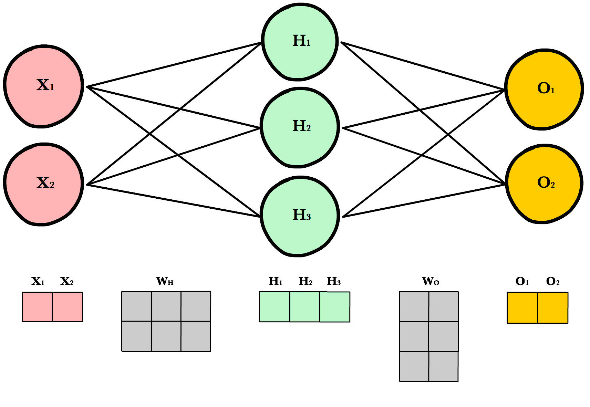

# Домашно 2 - Класификация на ръкописни цифри

За вашето второ предизвикателство като начинаещ програмист, вие сте поканени да се потопите в света на невронните мрежи и машинното обучение с фокус върху класификацията на ръкописни цифри. Господин Георгиев ви предоставя вече обучен модел на конволюционна невронна мрежа, специализирана за разпознаване и класификация на ръкописни цифри от 0 до 9. Крайната цел на домашното е да помогнете на господин Тодоров да разшифрира числата от заданията ви по МОПр.

Основната цел на домашното ви е да имплементирате правилната архитектура на невронната мрежа за извличане на предположения. Вие ще трябва да се запознаете с процеса на извършване на предположения и интерпретиране на резултатите. Това включва разбиране на начина, по който моделът обработва входните данни, както и анализ на връзките между различните слоеве на мрежата и тяхното въздействие върху крайния резултат.

## 0. Инструкции

Невронните мрежи за изградени по следния начин: 

Допълнителни информация за домашното можете да намерите тук: [link](https://docs.google.com/document/d/1r8NKjcH9MgW0Gb7GDvRwABqOn6-0J2ttXRrAy-AN8Go/edit?usp=sharing)

#### 1. Входен слой
- С `X` означаваме входния вектор.

#### 2. Тежести и отклонения
- Всеки слой `l` в невронната мрежа има матрица на тежестите `W[l]` и вектор на отклоненията `b[l]`.
- `W^[l]` има размери `(n[l-1],  n[l])`, където `n^[l]` е броя на невроните в слой `l` и `n^[l-1]` е броя на невроните в предишния слой.
- `b^[l]` е вектор с размер `n[l]`.

#### 3. Право разпространяване за всеки слой
- За всеки слой `l`, изчислете изхода `A[l]` (където `A[0]` е входния вектор `X`) чрез формулата:
  - `Z[l] = A[l-1]W[l] + b[l]`
  - `A[l] = g[l](Z[l])`
- Тук, `g[l]` е активационната фунцикия на слой `l`. Често срещани варианти за `g` включват [sigmoid](https://en.wikipedia.org/wiki/Sigmoid_function), [softmax](https://en.wikipedia.org/wiki/Softmax_function), [tanh](https://en.wikipedia.org/wiki/Hyperbolic_functions#Definitions) и [ReLU](https://en.wikipedia.org/wiki/Rectifier_(neural_networks)).

#### 4. Изходен слой
- Изходът от последния слой `A^[L]` (където `L` е индексът на последния слой) е предположението на невронната мрежа.

( използвайте numpy матрици, за всички задачи )

## 1. Активационни функции

Имплементирайте активационните функции [sigmoid](https://en.wikipedia.org/wiki/Sigmoid_function), [tanh](https://en.wikipedia.org/wiki/Hyperbolic_functions#Definitions), [softmax](https://en.wikipedia.org/wiki/Softmax_function), [tanh](https://en.wikipedia.org/wiki/Hyperbolic_functions#Definitions) и [ReLU](https://en.wikipedia.org/wiki/Rectifier_(neural_networks)). Имплементирайте и функция `flatten` която превръща numpy матрица `N1xN2x...xNm` в матрица `1x(N1 . N2 . ... . Nm)`.

Запишете решенията си в [src/activation_functions.py](src/activation_functions.py).

## 2. Алгоритъм за право разпространяване

Направете `activation_functions` - `dictionary` с :
- ключ - името на функцията
- стойност - всяка функция от предишната задача.

Имплементирайте алгоритъма за право разпространяване в невронна мрежа.
Функцията `forward_propagation` трябва да връща функция с единствен входен параметър - `matrix` и изход - резултатът след изпълняване на алгоритъма за право разпространяване за всеки слой от `layers`. 

`layers` е списък от `dictionary`-та с ключове и стойности:
- `weights` - numpy матрица на тежестите 
- `bias` - numpy вектор на отклоненията
- `activation` - string с името на активационната функция от `activation_functions`

Ако липсват `weights` и `bias`, приложете единствено `activation` върху резултатната матрица от предишния слой.

Запишете решенията си в [src/forward_propagation.py](src/forward_propagation.py).
